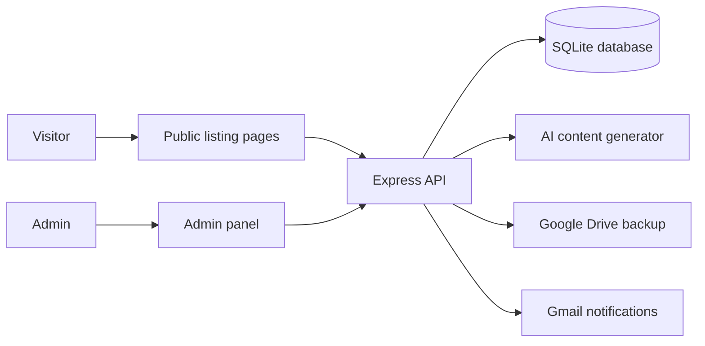

# MalickLand — WV Property Intelligence

West Virginia real estate listing platform. Admin panel, public listing pages, photo uploads, AI marketing content, and Google Drive/Gmail integration.

**Live site:** [malickland.net](https://malickland.net)

---

## Stack

| Layer | Tech |
|-------|------|
| Runtime | Node.js 20 LTS |
| Framework | Express 5 |
| Database | SQLite via better-sqlite3 |
| Auth | Session-based (admin panel) + API key (REST) |
| Images | Local disk + Google Drive backup |
| Email | Gmail API via OAuth2 |
| AI | OpenAI GPT-4o (listing content generation) |
| Deploy | Hostinger VPS — Docker + Traefik (manual deploy) |

---

## Architecture



---

## Project Structure

```
wv-property-intelligence/
├── api/                    ← Backend (Node/Express)
│   ├── server.js           ← Entry point, middleware, static routes
│   ├── db.js               ← SQLite connection, schema, migrations, seeding
│   ├── helpers.js          ← Shared utilities (esc, slugify, etc.)
│   ├── google.js           ← Gmail + Drive integration (no SDK)
│   ├── ai-generator.js     ← OpenAI listing content engine
│   ├── db-migrate-ai.js    ← One-time migration script (ai_content columns)
│   ├── middleware/
│   │   ├── auth.js         ← requireAuth, requireCsrf, requireApiKey
│   │   └── rate-limits.js  ← Per-route rate limiters
│   ├── routes/
│   │   ├── admin.js        ← /admin/* (session-protected)
│   │   ├── api.js          ← /api/* (public + API-key endpoints)
│   │   └── public.js       ← /robots.txt, /sitemap.xml, /listing/:id
│   └── views/
│       └── admin.js        ← Server-rendered admin HTML shell
├── app/                    ← Frontend (vanilla JS, no build step)
│   ├── index.html          ← Public listing search page
│   ├── listings.html       ← Static listings index
│   ├── 37-advent.html      ← Advent landing page, served at /37-advent
│   ├── listing.html        ← Single property detail page
│   ├── admin.html          ← Admin login page
│   ├── app.js              ← Listing grid, filters, modal, contact form
│   └── listing.js          ← Property detail + inquiry form
├── database/
│   ├── wv_property.db      ← SQLite database (runtime, gitignored)
│   └── schema.sql          ← Reference schema (SQLite, documentation only)
├── listings/               ← Per-property file storage (gitignored)
│   └── _template/          ← Folder structure reference
├── api/Dockerfile          ← Multi-stage Docker build
└── compose.yml             ← Local Docker Compose
```

---

## Getting Started

### Local dev (without Docker)

```bash
cd api
cp .env.example .env      # fill in values
npm install
npm run dev               # nodemon server.js
```

Server: `http://localhost:3001`
Admin: `http://localhost:3001/admin` (password from `ADMIN_PASSWORD` env)

For local review, start with `SESSION_SECRET` and `ADMIN_PASSWORD`, then add
optional Google, Gmail, and OpenAI credentials only for the integrations you are
actively testing. The local SQLite database and local file storage are enough to
exercise the core listing/admin flow.

### Local dev (with Docker)

```bash
docker compose up --build
```

---

## Environment Variables

All env vars live in `api/.env`. See [`api/.env.example`](api/.env.example) for the full annotated list.

Required to run:
- `SESSION_SECRET` — any long random string
- `ADMIN_PASSWORD` — admin panel password

Optional integrations:
- **Gmail notifications:** `GOOGLE_CLIENT_ID`, `GOOGLE_CLIENT_SECRET`, `GOOGLE_REFRESH_TOKEN`, `GOOGLE_GMAIL_USER`, `NOTIFICATION_EMAIL`
- **Drive photo backup:** `GOOGLE_DRIVE_FOLDER_ID`
- **AI content generation:** `OPENAI_API_KEY` (optional `OPENAI_MODEL`)
- **REST API auth:** `API_KEY`

---

## API Routes

| Method | Path | Auth | Description |
|--------|------|------|-------------|
| GET | `/api/health` | Public | Health check |
| GET | `/api/counties` | Public | All 55 WV counties |
| GET | `/api/properties` | Public | Active listings (paginated, filterable) |
| GET | `/api/properties/:id` | Public | Single property detail |
| POST | `/api/properties` | API Key | Create property |
| PUT | `/api/properties/:id` | API Key | Update property |
| DELETE | `/api/properties/:id` | API Key | Delete property |
| GET | `/api/analytics` | Public | Aggregate stats |
| POST | `/api/contacts` | Public | Submit lead inquiry |
| GET | `/api/contacts` | API Key | List all leads |
| POST | `/api/properties/generate-description` | Public (rate-limited) | Quick AI description |

`GET /api/properties` query params: `q`, `county`, `type`, `minPrice`, `maxPrice`, `page`, `limit`

---

## Admin Routes

All require session auth (`/admin/login`).

| Path | Description |
|------|-------------|
| `GET /admin` | Listings dashboard |
| `GET /admin/new` | New listing form |
| `POST /admin/new` | Create listing |
| `GET /admin/edit/:id` | Edit listing form |
| `POST /admin/edit/:id` | Save edits |
| `GET /admin/photos/:slug` | Photo manager |
| `POST /admin/upload/:slug` | Upload photo |
| `GET /admin/report/:id` | Comps + due diligence |
| `GET /admin/ai/:id` | AI content viewer |
| `POST /admin/ai/:id` | Generate/regenerate AI content |
| `GET /admin/integrations` | Gmail + Drive status |

---

## AI Listing Machine

With `OPENAI_API_KEY` set, every listing gets a full marketing package via OpenAI.
Default model is `gpt-4o` (override with `OPENAI_MODEL`), with automatic fallback to `gpt-4o-mini` when account access is limited:
MLS description, investor pitch, Facebook ad, Instagram caption, video script, email blast, SMS, landing page copy.

Cost: ~$0.01–0.03 per listing. Access via **Admin → AI** button on any listing.

---

## Deploy (Hostinger VPS — Docker + Traefik)

Production runs as a Docker container on Phil's Hostinger VPS (`srv1716268` / `31.97.58.203`), behind **Traefik** with Let's Encrypt TLS. **Deploys are manual** — merging to `main` does **not** update production. To deploy a reviewed, Phil-approved commit:

```bash
ssh root@31.97.58.203
git -C /docker/wv-property-intelligence/src fetch origin
git -C /docker/wv-property-intelligence/src checkout <sha>
cd /docker/wv-property-intelligence && docker compose build && docker compose up -d
```

After deploy, prove the live commit from the local repo:

```bash
EXPECTED_SHA=<full-git-sha> bash scripts/verify-vps-prod.sh
```

Persistent data lives on the Docker named volume `wv-property-intelligence_wv-data`, mounted at `/data`. Set both `DATABASE_PATH=/data/wv_property.db` and `LISTINGS_ROOT=/data/listings` in `/docker/wv-property-intelligence/.env` so admin photo uploads survive rebuilds and `docker compose up -d --force-recreate`. Secrets are set in that `.env` file, not in the repo.

> The old Railway service (`alert-laughter` / `wv-property-intelligence`) was deleted on 2026-06-18. Production runs solely on the Hostinger VPS, and Railway deployments/GitHub deployment records are not production proof. `railway.json` and `railway.toml` were removed from the repo. See `docs/CANONICAL_MAP.md` for the full production map.

---

## Brand

Deep forest green `#1B4332` · Warm gold `#D4AF37` · System UI / Segoe UI
